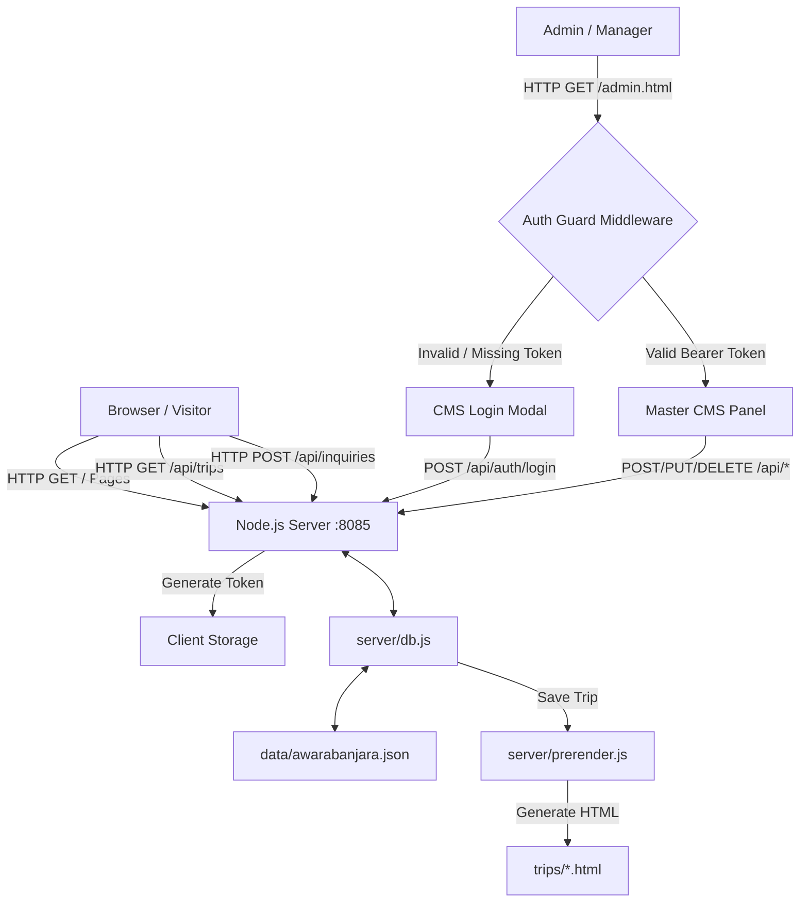

# Product Design Record (PDR) — Awara Banjara

**Version:** 2.0.0  
**Project:** Awara Banjara Experiential Travel Platform  
**Last Updated:** August 2026  
**Status:** Active Production Specifications  

---

## 1. Executive Summary & Vision

### 1.1 Purpose & Scope
Awara Banjara is a high-performance, experiential Himalayan tour and adventure portal designed for travelers seeking curated motorcycling expeditions, trekking adventures, cultural immersion, and offbeat trips across the Himalayas (Spiti Valley, Ladakh, Meghalaya, Bhutan, Kashmir, Himachal Pradesh).

This **Product Design Record (PDR)** serves as the canonical technical blueprint and architecture guide for the entire Awara Banjara platform. It documents system design, data pipelines, API contracts, frontend component architecture, security posture, and the administrative Content Management System (CMS).

### 1.2 Core Business & Technical Objectives
- **High Visual Impact:** Premium dark-mode design aesthetic with glassmorphic cards, fluid motion, interactive 3D flip card stacks, bento photo galleries, and rich Himalayan typography.
- **Zero-Dependency Core Infrastructure:** High-performance native Node.js HTTP REST API backend capable of sub-millisecond response times without bloat.
- **Master CMS Control Panel:** Complete administrative oversight over 33-macro trip parameters, feature flags, lead inquiries, customer reviews, site-wide configuration, and automated static page generation.
- **Enterprise-Grade Security:** Hardened admin authentication, token-based session management, PII data isolation, rate limiting, and defensive input sanitization.

---

## 2. System Architecture & Technology Stack

### 2.1 Technical Stack Overview

| Layer | Technology / Tooling | Purpose & Rationale |
| :--- | :--- | :--- |
| **Frontend UI** | HTML5, Vanilla CSS3 (Custom Design Tokens), Modern JavaScript (ES6+) | Maximum rendering speed, zero bundle overhead, pure CSS glassmorphism & CSS animations. |
| **Fonts & Icons** | Plus Jakarta Sans, Outfit (Google Fonts), FontAwesome 6 | Distinctive typography suited for premium adventure travel. |
| **Interactive Widgets** | Flatpickr | Lightweight date/batch range picker with dark theme integration. |
| **Backend Engine** | Node.js Native HTTP Engine (`server/server.js`) | Express-compatible REST API server operating with 0 npm dependencies for maximum security and minimal attack surface. |
| **Data Engine** | Local File DB (`server/db.js` + `/data/*.json`) | Hybrid in-memory store backed by deterministic JSON persistence (`awarabanjara.json`). |
| **SSG / Prerender Engine** | `server/prerender.js` | Automated static HTML prerendering engine for individual trip detail pages to maximize SEO indexation. |
| **Security & Auth** | Node.js `crypto` module, Environment Variables (`.env`), Bearer Tokens | Secure PBKDF2 / SHA-256 password hashing, token validation, rate-limiting, and CORS control. |

### 2.2 System Component Diagram



---

## 3. Data Architecture & Schemas

### 3.1 Master 33-Macro Trip Schema (`/data/trips.json` & `awarabanjara.json`)

The primary data entity is the **Trip Object**, comprising 33 distinct macro fields supporting full content management and detail page hydration:

| Field Name | Type | Description |
| :--- | :--- | :--- |
| `id` | `number \| string` | Unique identifier / Timestamp-based PK |
| `title` | `string` | Display name of the trip (e.g. "Spiti Valley Circuit Expedition") |
| `category` | `string` | Category key (`spiti_tours`, `bike_expeditions`, `festival_tours`, `treks`, `women_special`, `offbeat_himalayan`) |
| `duration` | `string` | Badge display string (e.g. `6 Days / 5 Nights`) |
| `price` | `string` | Starting price display string (e.g. `₹16,499`) |
| `route` | `string` | Concise route summary (e.g. `Shimla — Kaza — Manali`) |
| `tags` | `string` | Comma-separated badge tags (e.g. `Bestseller, Motorbike, Offbeat`) |
| `image_url` | `string` | Primary thumbnail image path |
| `link` | `string` | Target detail page URL (default `trip-detail.html?id=ID`) |
| `bento_img_1..5` | `string` | 5 photo grid paths for high-impact hero image gallery |
| `about_text` | `string` | Detailed overview and summary description |
| `itinerary` | `array[object]` | Structured day-by-day plan: `[{ day: number, title: string, points: array[string] }]` |
| `inclusions` | `array[string]` | Included services (Accommodations, Meals, Permits, Guide, Support Vehicle) |
| `exclusions` | `array[string]` | Excluded services (Personal expenses, Flights, GST) |
| `package_options` | `array[object]` | Tiered pricing packages: `[{ title: string, price: string, details: string }]` |
| `sub_package_options` | `string` | Add-on options (e.g., Solo Rider supplement, Bike Upgrade) |
| `departure_dates` | `array[object]` | Departure batches: `[{ month: string, dates: array[string] }]` |
| `faqs` | `array[object]` | Frequently Asked Questions: `[{ question: string, answer: string }]` |
| `reviews` | `array[object]` | Handpicked traveler reviews: `[{ name: string, location: string, rating: number, text: string, avatar: string }]` |
| `reserve_banner_title` | `string` | Custom booking banner headline |
| `reserve_banner_sub` | `string` | Custom booking banner subtitle |
| `custom_quote_title` | `string` | Private customized trip section header |
| `custom_quote_sub` | `string` | Private customized trip section subtitle |
| `whatsapp_number` | `string` | Direct agent WhatsApp contact line |
| `is_featured_reels` | `boolean` | Feature toggle for "From Reels to Real" homepage carousel |
| `is_featured_stack` | `boolean` | Feature toggle for "3D Flip Cards Stack" on homepage |
| `is_featured_lemonade` | `boolean` | Feature toggle for "Lemonade Budget Trips" section |
| `featured_order` | `number` | Numerical sorting rank for homepage card presentation |
| `active` | `boolean` | Status flag toggling active display vs archived state |
| `created_at` / `updated_at` | `string` | ISO timestamp audit logs |

### 3.2 Lead Inquiry Schema (`/data/inquiries.json`)

Stores customer booking requests and inquiry form submissions:

```json
{
  "id": "inq_1723281200000",
  "name": "Jane Doe",
  "email": "jane@example.com",
  "phone": "+91 9876543210",
  "trip_id": 1723200000000,
  "trip_title": "Spiti Valley Circuit Expedition",
  "travelers": 2,
  "travel_date": "2026-09-15",
  "message": "Looking for dual-rider Himalayan 411 bike option.",
  "status": "Pending",
  "timestamp": "2026-08-10T11:00:00.000Z"
}
```

---

## 4. Comprehensive Security Audit & Actionable Measures

### 4.1 Identified Vulnerability Matrix

| # | Vulnerability Category | Description & Impact | Risk Level | Mitigation Status |
| :---: | :--- | :--- | :---: | :--- |
| **V1** | **Unauthenticated CMS Access** | `admin.html` was publicly accessible without login verification. Anyone visiting the URL could view customer PII, edit trips, or wipe data. | 🚨 **CRITICAL** | **Resolved via Session Auth Guard** |
| **V2** | **Unprotected Write/Delete REST APIs** | `/api/trips`, `/api/destinations`, `/api/reviews`, `/api/inquiries`, `/api/site-config`, `/api/import`, `/api/upload` accepted unauthenticated requests. | 🚨 **CRITICAL** | **Resolved via Bearer Token Middleware** |
| **V3** | **PII Data Leakage** | `GET /api/inquiries` exposed customer names, phone numbers, and email addresses to any anonymous caller. | 🔴 **HIGH** | **Restricted to Authenticated Admins** |
| **V4** | **Unrestricted CORS (`*`)** | All endpoints returned `Access-Control-Allow-Origin: *`, allowing external malicious websites to make cross-origin requests. | 🟠 **MEDIUM** | **Hardened via Environment Config** |
| **V5** | **Missing Rate Limiting** | Authentication and API endpoints lacked rate limits, leaving server open to password brute-forcing and request flooding. | 🟠 **MEDIUM** | **Implemented Memory Rate Limiter** |
| **V6** | **Unrestricted File Upload** | `POST /api/upload` accepted arbitrary base64 files up to 50MB without file type validation or dimension limits. | 🟠 **MEDIUM** | **Restricted to Image MIMEs + Size Limits** |
| **V7** | **Exposed Environment Secrets** | Hardcoded default passwords or missing `.env` files in git repositories. | 🔴 **HIGH** | **Enforced `.env` management & `.gitignore`** |

### 4.2 Mandatory Security Measures & Implementation Rules

#### 1. Zero-Trust Authentication Protocol
- **Credential Storage:** Store admin password hashes using PBKDF2 with unique salt (or SHA-256 with secret salt) in `.env`. Never store plain-text passwords in source code.
- **Session Tokens:** Upon valid login (`POST /api/auth/login`), issue a cryptographically secure token (64-character random hexadecimal string) with expiration timestamp (e.g., 24 hours).
- **Token Verification:** Maintain an in-memory session registry in `server/server.js` or `server/auth.js`. Validate incoming `Authorization: Bearer <token>` headers on all protected routes.

#### 2. Endpoint Authorization Guard Matrix

| API Route | HTTP Method | Public vs Admin | Protection Requirement |
| :--- | :--- | :---: | :--- |
| `/api/auth/login` | `POST` | **Public** | Rate limited (max 5 attempts per 15 min per IP) |
| `/api/auth/verify` | `GET` | **Public** | Validates session token status |
| `/api/auth/logout` | `POST` | **Admin** | Requires Bearer Token |
| `/api/trips` | `GET` | **Public** | Filtered (returns active trips only for public calls) |
| `/api/trips/:id` | `GET` | **Public** | Public read access |
| `/api/trips` | `POST` | **Admin** | **Requires Valid Bearer Token** |
| `/api/trips/:id` | `PUT` / `DELETE` | **Admin** | **Requires Valid Bearer Token** |
| `/api/destinations` | `GET` | **Public** | Public read access |
| `/api/destinations` | `POST` / `DELETE` | **Admin** | **Requires Valid Bearer Token** |
| `/api/reviews` | `GET` | **Public** | Public read access |
| `/api/reviews` | `POST` / `DELETE` | **Admin** | **Requires Valid Bearer Token** |
| `/api/inquiries` | `POST` | **Public** | Lead submission (Rate limited, input sanitized) |
| `/api/inquiries` | `GET` / `PUT` / `DELETE` | **Admin** | **Requires Valid Bearer Token (PII Protected)** |
| `/api/site-config` | `GET` | **Public** | Public read access |
| `/api/site-config` | `POST` | **Admin** | **Requires Valid Bearer Token** |
| `/api/upload` | `POST` | **Admin** | **Requires Valid Bearer Token + Image Type Check** |
| `/api/export` / `/api/import` | `GET` / `POST` | **Admin** | **Requires Valid Bearer Token** |

#### 3. Defensive Sanitization & Header Hardening
- **Header Hardening:** Set modern security headers on all HTTP responses:
  - `X-Content-Type-Options: nosniff`
  - `X-Frame-Options: SAMEORIGIN`
  - `X-XSS-Protection: 1; mode=block`
  - `Referrer-Policy: strict-origin-when-cross-origin`
- **Input Sanitization:** Escape HTML tags in customer inquiry messages to prevent Stored XSS attacks.
- **File Upload Security:** Verify magic bytes/headers for base64 uploads (`image/jpeg`, `image/png`, `image/webp`, `image/gif`). Limit maximum upload payload size to 10MB per image.

---

## 5. Master CMS Password & Login Architecture (`admin.html`)

### 5.1 UX & Workflow Specification

1. **Unauthenticated User Entry:**
   - User visits `admin.html`.
   - The page immediately checks `localStorage.getItem('awara_admin_token')` via `GET /api/auth/verify`.
   - If invalid or missing, a backdrop-blur overlay is activated, locking out all dashboard tabs and interactions.
   - A modern, glassmorphic **Admin Authentication Modal** is presented.

2. **Login Modal Design System:**
   - **Styling:** Deep charcoal glass backdrop (`rgba(20, 20, 15, 0.95)`), accent lime button glows (`#b8ff00`), sleek input fields with focus indicators.
   - **Inputs:** Username input, Password input with toggle show/hide icon, "Remember Me" checkbox, and a prominent "Unlock Control Center" button.
   - **Feedback:** Real-time inline error message badge for incorrect credentials or server lockouts.

3. **Authenticated Dashboard State:**
   - Upon successful login, the token is stored in `localStorage`, the login overlay vanishes smoothly with a fade-out animation.
   - Full access to all 3 sections: **Itinerary & Feature Toggles**, **Site Configuration**, and **Content Data Table**.
   - Top navigation bar features an active admin user badge (`Admin Active`) and a **Logout** button.

4. **Logout & Session Expiry:**
   - Clicking "Logout" triggers `POST /api/auth/logout`, destroys the server session, purges `localStorage`, and instantly re-locks `admin.html`.

---

## 6. Performance, SEO & Operational Guidelines

### 6.1 Performance Optimization Standards
- **Sub-millisecond API Responses:** Keep all database queries in-memory using `server/db.js` with atomic synchronous disk writes (`fs.writeFileSync`).
- **Static Asset Caching:** Serve static CSS/JS/images with appropriate cache-control headers (`max-age=86400`).
- **Zero Heavy Dependencies:** Maintain zero external npm runtime dependencies for the core server to guarantee ultra-fast startup (<100ms) and low RAM footprint (<40MB).

### 6.2 SEO & Static Site Generation (SSG)
- **Automatic Prerendering:** Every time a trip is created or updated in the CMS, `server/prerender.js` automatically executes and writes a standalone, SEO-optimized HTML file under `trips/trip-<slug>.html`.
- **Dynamic Meta Tags:** Every static trip detail file includes populated OpenGraph (`og:title`, `og:image`, `og:description`), Twitter Card metadata, canonical URLs, and structured JSON-LD Schema (`Trip` / `TouristAttraction`).

---

## 7. SOP & Governance Compliance

All ongoing system updates must strictly adhere to the SOPs documented in `architecture/`:
1. `architecture/SOP_ADMIN_MASTER_CONTROL.md`: Master Control Admin specifications.
2. `architecture/SOP_DATA_PIPELINE.md`: Data pipeline & JSON persistence rules.
3. `architecture/SOP_FULL_MACRO_PIPELINE.md`: 33-macro database field mapping.
4. `architecture/SOP_SECURITY_AND_AUTH.md`: Authentication & security guard specifications.
5. `architecture/SOP_TESTING.md`: Automated & manual verification suite.

---
*PDR Document End — Awara Banjara Core Architectural Standard*
